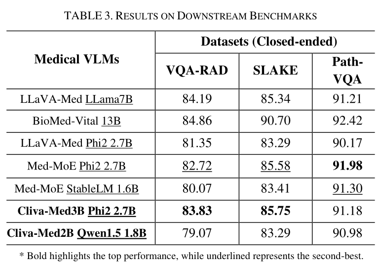

# **Cliva-Med: A Family of Lightweight Medical Multimodal Models**

<p align="center">
  
</p>

📖 [Technical report](#) | 🤗 [Data](#) | 🤖 [Data](#) | 🤗 [HFSpace](#) 🩺 [Demo](#)

## **Cliva-Med-Llama-3-8B-V**:

🤗 [v1.1](#) | 🤗 [v1.0](#) | 🤗 [v1.0-GGUF](#)

## **Cliva-Med-4B**:

🤗 [v1.1](#) | 🤗 [v1.0](#) | 🤗 [v1.0-GGUF](#)

Cliva-Med is a family of lightweight yet powerful multimodal medical models designed for efficient health-related tasks. It offers multiple plug-and-play vision encoders, = **SigLIP**, and advanced language backbones like ***Phi-1.5**, **StableLM-2**, **Qwen1.5**, and **Phi-2**. To optimize performance despite the smaller model sizes, Cliva-Med incorporates more informative training data, carefully curated from diverse and specialized medical sources.


<details>
<summary>Expand to see the performance of Cliva-Med-4B</summary>

</details>

### Release Notes

* **2024.05.08**: **Cliva-Med-v1.1-4B**, supporting 1152x1152 resolution, is released! It leverages **SigLIP** and **Phi-3-Mini-4K 3.8B** with an **S\$`^2`\$-Wrapper**. Check more details on [HuggingFace](#) and [Demo](#).
* **2024.05.01**: **Cliva-Med-v1.0-4B**, a vision-language model based on **Phi-3**, is released! Explore more on [HuggingFace](#) and [GGUF](#).
* **2024.04.21**: **Cliva-Med-Llama-3-8B-V**, the first vision-language model based on **Llama-3**, is released! Check more details on [HuggingFace](#) and [ModelScope](#).
* **2024.04.18**: **Cliva-Med-v1.0-3B-zh**, optimized for Chinese-English medical tasks, is released! Visit [HuggingFace](#) and [ModelScope](#) for more information.
* **2024.03.15**: **Cliva-Med-v1.0-2B-zh**, focused on Chinese medical content, is now available! Visit [HuggingFace](#) and [ModelScope](#).

### **Cliva-Med Training Data**

* Released: **2024.03.06**
  Check more details about **Cliva-Med v1.0-data** on [HuggingFace](#) and [ModelScope](#).

---

## **Quickstart Guide**

### Using Cliva-Med Models with HuggingFace Transformers

To integrate Cliva-Med models, such as **Cliva-Med-v1.1-Llama-3-8B-V** or **Cliva-Med-v1.1-4B**, with HuggingFace transformers, follow the steps below.

### Prerequisites:

Before running the code, you need to install the following dependencies:

```shell
pip install torch transformers accelerate pillow
```

If your system has sufficient CUDA memory, setting `CUDA_VISIBLE_DEVICES=0` can speed up execution.

### Code Example for HuggingFace Transformers

```python
import torch
import transformers
from transformers import AutoModelForCausalLM, AutoTokenizer
from PIL import Image
import warnings

# disable some warnings
transformers.logging.set_verbosity_error()
transformers.logging.disable_progress_bar()
warnings.filterwarnings('ignore')

# set device
device = 'cuda'  # or cpu
torch.set_default_device(device)

# Load Cliva-Med model and tokenizer
model_name = 'BAAI/Cliva-Med-v1_1-Llama-3-8B-V' # or 'BAAI/Cliva-Med-v1_1-4B'
offset_bos = 1  # Adjust for different models

# Load the model
model = AutoModelForCausalLM.from_pretrained(
    model_name,
    torch_dtype=torch.float16,  # Use float32 for CPU
    device_map='auto',
    trust_remote_code=True
)

# Load tokenizer
tokenizer = AutoTokenizer.from_pretrained(
    model_name,
    trust_remote_code=True
)

# Define the text prompt
prompt = 'What are the common symptoms of liver disease?'

# Define input text with an image placeholder
text = f"A conversation between a user and an AI assistant. The assistant provides detailed and accurate answers to medical inquiries. USER: <image>\n{prompt} ASSISTANT:"

# Tokenize the input text
text_chunks = [tokenizer(chunk).input_ids for chunk in text.split('<image>')]
input_ids = torch.tensor(text_chunks[0] + [-200] + text_chunks[1][offset_bos:], dtype=torch.long).unsqueeze(0).to(device)

# Load and preprocess the medical image (example)
image = Image.open('example_medical_image.png')
image_tensor = model.process_images([image], model.config).to(dtype=model.dtype, device=device)

# Generate response
output_ids = model.generate(
    input_ids,
    images=image_tensor,
    max_new_tokens=100,
    use_cache=True,
    repetition_penalty=1.0  # Adjust to avoid excessive repetition
)[0]

# Decode and print the model's response
response = tokenizer.decode(output_ids[input_ids.shape[1]:], skip_special_tokens=True).strip()
print(response)
```

---

### ModelScope Integration

Users in China can also use **ModelScope** for a more localized experience. Here's how you can integrate Cliva-Med with ModelScope:

```python
import torch
import transformers
from modelscope import AutoTokenizer, AutoModelForCausalLM
from modelscope.hub.snapshot_download import snapshot_download
from PIL import Image
import warnings

# disable some warnings
transformers.logging.set_verbosity_error()
transformers.logging.disable_progress_bar()
warnings.filterwarnings('ignore')

# Set device for model execution
device = 'cuda'  # or cpu
torch.set_default_device(device)

# Model name and configuration
model_name = 'BAAI/Cliva-Med-v1_1-Llama-3-8B-V'
offset_bos = 1

# Load model
snapshot_download(model_id='cliva-model/siglip-medical-v1')
model = AutoModelForCausalLM.from_pretrained(
    model_name,
    torch_dtype=torch.float16,  # Use float32 for CPU
    device_map='auto',
    trust_remote_code=True
)

# Load tokenizer
tokenizer = AutoTokenizer.from_pretrained(
    model_name,
    trust_remote_code=True
)

# Example text prompt
prompt = "What is the latest treatment for liver cancer?"

# Define and process the input text
text = f"A medical consultation between a user and an AI assistant. The assistant offers evidence-based, detailed medical insights. USER: <image>\n{prompt} ASSISTANT:"
text_chunks = [tokenizer(chunk).input_ids for chunk in text.split('<image>')]
input_ids = torch.tensor(text_chunks[0] + [-200] + text_chunks[1][offset_bos:], dtype=torch.long).unsqueeze(0).to(device)

# Example medical image
image = Image.open('example_medical_image.png')
image_tensor = model.process_images([image], model.config).to(dtype=model.dtype, device=device)

# Generate the response
output_ids = model.generate(
    input_ids,
    images=image_tensor,
    max_new_tokens=100,
    use_cache=True,
    repetition_penalty=1.0
)[0]

# Decode and print the result
response = tokenizer.decode(output_ids[input_ids.shape[1]:], skip_special_tokens=True).strip()
print(response)
```

---

## **Cliva-Med Key Features:**

* **Lightweight and Efficient**: Optimized for medical image and text processing with a focus on small model sizes while maintaining high performance.
* **Multimodal Support**: Includes both vision and language processing capabilities, making it perfect for medical tasks requiring both visual and textual inputs.
* **High-Resolution Image Support**: Supports high-resolution medical images up to **1152x1152**, enabling detailed analysis.
* **Pre-trained on Medical Datasets**: Trained on diverse medical datasets,


including image-based clinical data, radiological images, and more.

* **Optimized for Healthcare Tasks**: Whether it's generating clinical insights, assisting in diagnosis, or answering medical questions, Cliva-Med excels in healthcare applications.

---

## **Usage Notes:**

* **Fine-Tuning**: Users can fine-tune **Cliva-Med** on their specific medical data using the provided scripts for further customization.
* **Performance Optimizations**: Cliva-Med supports GPU-based acceleration for efficient execution.

---

## **Contact**

For further inquiries, reach out to **junsteffa@gmail.com**.

